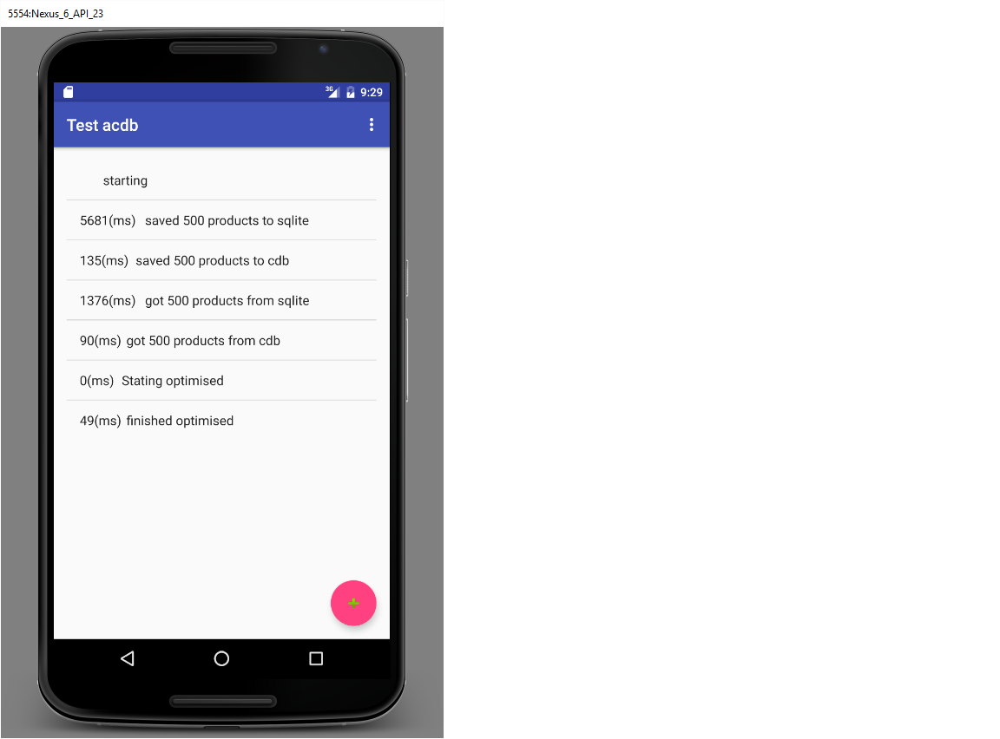

# acdb
======

An android implementation of CDB database

This is an implementation of [CDB] (https://cr.yp.to/cdb.html)

CDB is useful if you have a static or relatively static database.

The key concepts of CDB

1. Fast lookups
2. Low overhead
3. No size limits
4. Fast replacement

I used the source code from [strangeGizmo.com](http://www.strangegizmo.com/products/sg-cdb/)

For me the testing went very well.
I am seeing five to ten times improvement in speed over sqlite.

The sample application loads 500 objects into a cdb database and aan SQLList database form comparison.

## Speed Comparison

This test is very simple so I would advise downloading the code and testing the performance for yourself.
All these were run on and android studio vm.

| Action              | Sqlite    | Cdb    |
| ------------------- |:---------:|-------:|
| Insert 500 objects  | 5490 ms   | 139 ms |
| Select 500 objects  | 1498 ms   | 116 ms |
| Optimised Select    |           |  52 ms |

## Initialization

To create a new database we select a file and use CDBMake to create the database

<code>
                CdbMake make = new CdbMake();
                try {
                    make.start(filepath);
                    for (int i = 0; i < itemCount; ++i) {
                        Product product = new Product(i, "Product " + i, i);
                        make.add(ByteArrayUtil.toByteArray(product.getID()), ByteArrayUtil.toByteArray(product));
                    }
                    make.finish();
                } catch (IOException e) {
                    e.printStackTrace();
                }

</code>

